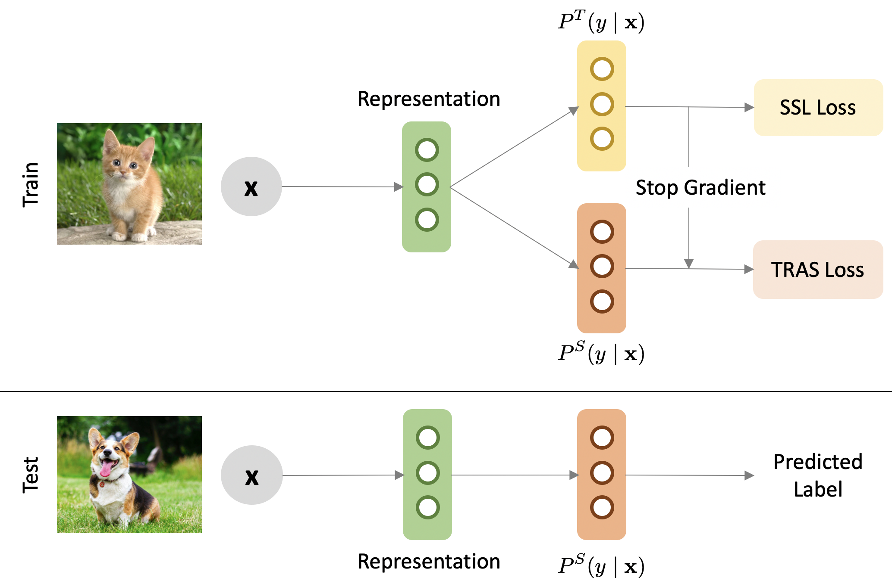

# Transfer and Share: Semi-Supervised Learning from Long-Tailed Data

by [Tong Wei](http://palm.seu.edu.cn/weitong/homepage.html), [Qian-Yu Liu](http://www.lamda.nju.edu.cn/liuqy), [Jiang-Xin Shi](http://www.lamda.nju.edu.cn/shijx), Wei-Wei Tu and [Lan-Zhe Guo](http://www.lamda.nju.edu.cn/guolz) at SEU, NJU, and 4Paradigm Inc.

<code>[Preprint](https://arxiv.org/abs/2205.13358)</code>



This repository contains an official re-implementation of TRAS from the authors. Further information please contact [Tong Wei](mailto:weit@seu.edu.cn) and [Qian-Yu Liu](mailto:liuqy@lamda.nju.edu.cn).


**This repo has TRAS on Wide-ResNet 28.**


## Citation
If you find our work inspiring or use our codebase in your research, please consider giving a star ⭐ and a citation.
```
@article{wei2022transfer,
  title={Transfer and Share: Semi-Supervised Learning from Long-Tailed Data},
  author={Wei, Tong and Liu, Qian-Yu and Shi, Jiang-Xin and Tu, Wei-Wei and Guo, Lan-Zhe},
  journal={arXiv preprint arXiv:2205.13358},
  year={2022}
}
```

## Table of contents
<!-- @import "[TOC]" {cmd="toc" depthFrom=1 depthTo=1 orderedList=false} -->

<!-- code_chunk_output -->

- Transfer and Share: Semi-Supervised Learning from Long-Tailed Data
  - [Table of contents](#table-of-contents)
  - [Requirements](#requirements)
  - [Dataset](#dataset-preparation)
  - [Training and Evaluation Instructions](#training-and-evaluation-instructions)
  - [How to get support from us?](#how-to-get-support-from-us)
  - [Citation](#citation)

<!-- /code_chunk_output -->

## Requirements
* Python 3.8.8
* PyTorch 1.9.1+cu111
* torchvision
* randAugment (Pytorch re-implementation: https://github.com/ildoonet/pytorch-randaugment)
* pandas
* numpy

## Dataset
The code will download data automatically with the dataloader. We use data the same way as [ABC](https://github.com/LeeHyuck/ABC).

```
dataset
├── fix_cifar10.py
├── fix_cifar100.py
└── fix_svhn.py
```

## Training and Evaluation Instructions
Please check out `run.sh` for the script to run our TRAS.

```
python train.py --gpu 0 --label_ratio 20 --num_max 1000 --imb_ratio 100 \
--epoch 500 --val-iteration 500 --manualSeed 0 --dataset cifar10  \
--out out
```

## How to get support from us?
If you have any general questions, feel free to email us at `weit at seu.edu.cn` and `liuqy at lamda.nju.edu.cn`. If you have code or implementation-related questions, please feel free to send emails to us or open an issue in this codebase (We recommend that you open an issue in this codebase, because your questions may help others). 

